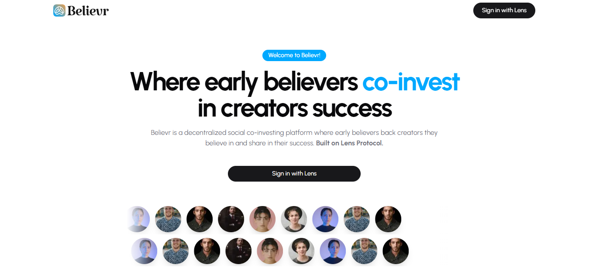

<a href="https://believr.fun">
  
  <h1 align="center">Believr</h1>
</a>

<p align="center">
A decentralized social platform where early backers co-invest in creators they believe in and share in their rise. Powered by Lens Protocol, it enables creators to launch tokenized campaigns to raise support, while backers earn rewards, access, and a stake in their journey.
</p>

## Problem

Creators have big project ideas but struggle to raise early support, while fans who believe in them have no real way to belong, benefit, or share in their success — there’s no shared upside; fans become donors, not co-owners.

## Solution

Believr is a decentralized platform where fans co-invest in creators by collecting tokenized posts, becoming co-owners with rewards, revenue share, and a stake in their success — all on-chain and community-owned.

## Features

- **Creator Campaigns** – Launch tokenized posts to raise funds directly from your community.
- **Fan Co-Investment** – Fans can collect and co-invest to gain ownership and rewards from their favorite creators.
- **Revenue Sharing** – Supporters earn a stake in a creator’s future success.
- **Exclusive Access** – Unlock gated content and private communities from creators.
- **Community-Owned** – Transparent, on-chain relationships with no intermediaries.

## How it Works

### For Creators

- Raise early funds directly from your true believers
- Build a loyal, invested community — not just followers
- Share success with the people who backed you from day one

### For Believers:

- Support creators you believe in — and share in their rise
- Get exclusive access, rewards, and real ownership
- Be more than a follower — be part of the story

## Tech Stack

- **Frontend**: [Next.js 15](https://nextjs.org/), [TypeScript 5](https://www.typescriptlang.org/), [Tailwind CSS 4](https://tailwindcss.com/), [Shadcn UI](https://ui.shadcn.com/)
- **Theme**: [next-themes](https://github.com/pacocoursey/next-themes)
- **Lens Integration**:
  - [`@lens-protocol/client`](https://docs.lens.xyz/docs/introduction)
  - [`@lens-protocol/react`](https://docs.lens.xyz/docs/react-intro)
  - [`@lens-chain/sdk`](https://github.com/lens-protocol/lens-chain-sdk)
- **Web3 Integration**: [wagmi](https://wagmi.sh/), [viem](https://viem.sh/), [ConnectKit](https://docs.family.co/connectkit)
- **Forms & Validation**: [react-hook-form](https://react-hook-form.com/), [zod](https://zod.dev/)
- **Data Fetching**: [TanStack Query](https://tanstack.com/query)
- **Date Handling**: [date-fns](https://date-fns.org/)
- **Charts & Visualization**: [Recharts](https://recharts.org/)
- **Icons**: [Lucide React](https://lucide.dev/guide/packages/lucide-react)
- **Notifications**: [Sonner](https://sonner.emilkowal.ski/)

## Lens Protocol Integration

- **Profiles** – Used for on-chain identities and unique handles for both fans and creators.
- **Lens Graph (Follows)** – Enables social discovery and relationship building by letting fans find and follow creators.
- **Posts** – Power project campaigns, creator updates, and tokenized content directly on-chain.
- **Collect Modules** – Allow fans to co-invest in creator posts, enabling ownership, rewards, and funding mechanics.
- **Groups** – Enable gated community access for collectors and top supporters, fostering exclusive creator-fan spaces.

## Setup

### Prerequisites

- Node.js 18+
- **Package Manager**: [Bun](https://bun.sh/)
- **Linting & Formatting**: [Biome](https://biomejs.dev/)

1. Clone the repository:

   ```bash
   git clone https://github.com/believr-fun/believr.git
   cd believr
   ```

2. Install dependencies:

   ```bash
   bun install
   ```

3. Set up environment variables:

   ```bash
   cp env.example .env
   ```

   Then edit `.env` and add your API keys and credentials:

   - Create a Lens app at [https://developer.lens.xyz/apps](https://developer.lens.xyz/apps)
   - Copy your App ID and paste it into the `.env` file as `NEXT_PUBLIC_APP_ADDRESS`

4. Start the development server:

   ```bash
   bun run dev
   ```

   Open [http://localhost:3000](http://localhost:3000) in your browser

## Roadmap

- [ ] Fully implement tokenized collection actions
- [ ] Complete gated community rules and access controls
- [ ] Implement creator dashboard for campaign and earnings
- [ ] Implement off-chain revenue sharing mechanisms

## Contributing

1. Create a new branch
2. Make your changes
3. Submit a pull request
